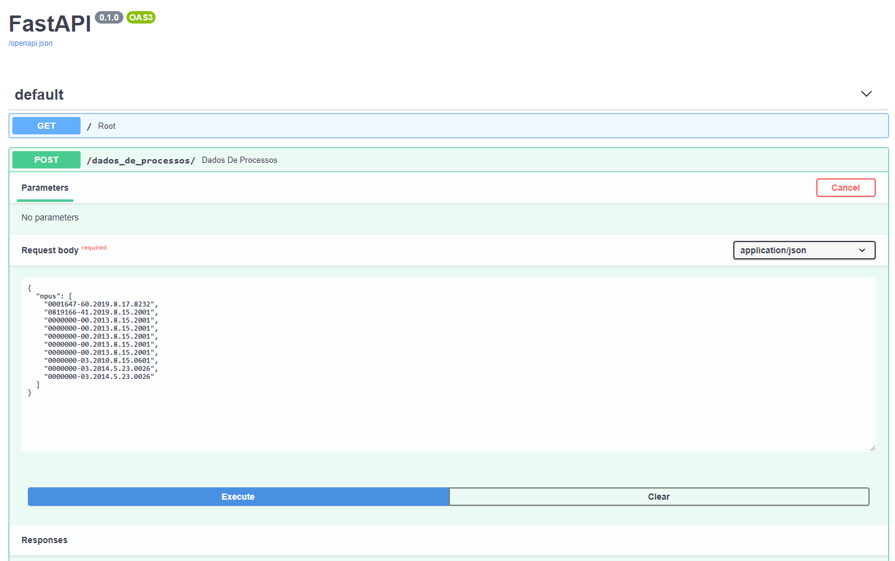

# Python API with FastAPI

## How to run

### Default

```java
pip install --upgrade pip
python -m pip install -r requirements.txt
pipenv shell
uvicorn main:app
```

Sample Output:

```java
INFO:     Started server process [5228]
INFO:     Waiting for application startup.
INFO:     Application startup complete.
INFO:     Uvicorn running on http://127.0.0.1:8000 (Press CTRL+C to quit)
```

### Inside a Docker Container

```java
pip install --upgrade pip
python -m pip install -r requirements.txt
uvicorn main:app --host 0.0.0.0 --port 800
```

## Docs

```java
http://127.0.0.1:8000/docs#/
```


